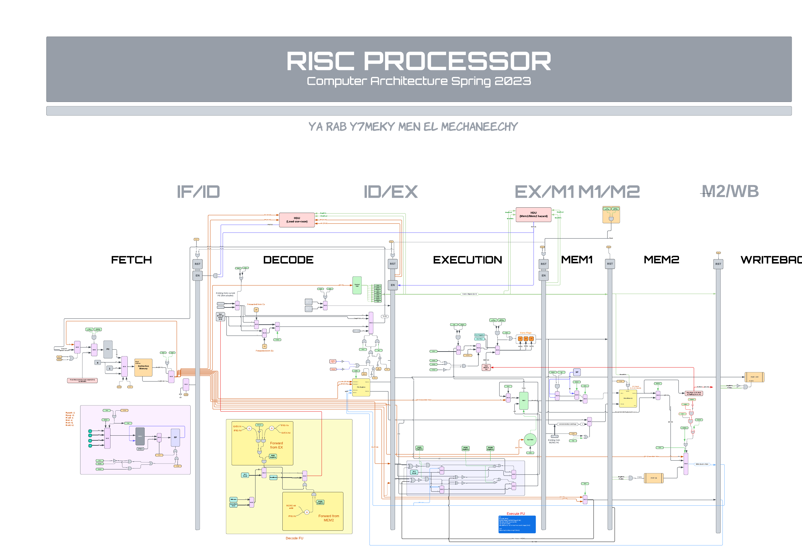

# Computer Architecture Project

---

## Team members
| Name   | ID |
| ------ | --- |
| Ahmed Ameen | 1190071  |
| Ali Hassan   | 2200011 |
| Hazem Montasser| 2200003 |
| Yousef Mahmoud Gilany|4200342|

## Semi-RISC Harvard, 6 stages, MIPS pipelined processor

RISC-like 6 stages pipelined 16-bit CPU with data, control, and structural hazard detection. Developed the ISA from scratch similar to MIPS architecture and implemented in VHDL with variable instruction width sizes (16 & 32) to maximize instruction cache usage.

The processor supports PUSH, POP, CALL, RET, INT (external signal), RETI, conditional jumps (carry, zero), unconditional jumps, immediate register load, move reg-to-reg, arithmetic operations, data memory store, load, input/output from a port into a register.

## ISA Specifications
### A) Registers
- R[0:7]<15:0> Eight 16-bit general purpose register
- PC<15:0> 16-bit program counter
- SP<15:0> 16-bit stack pointer
- CCR<2:0> condition code register
- Z<0>:=CCR<0> zero flag, change after arithmetic, logical, or shift operations
- N<0>:=CCR<1> negative flag, change after arithmetic, logical, or shift operations
- C<0>:=CCR<2> carry flag, change after arithmetic or shift operations.

### B) Input-Output
- IN.PORT<15:0> 16-bit data input port
- OUT.PORT<15:0> 16-bit data output port
- INTR.IN<0> a single, non-maskable interrupt
- RESET.IN<0> reset signal
### C) Instruction bits
*See  for more details.*


## Interrupt handling in HW

When an interrupt occurs, the processor finishes the currently fetched instructions (instructions that have already entered the pipeline), then the address of the next instruction (in PC) is saved on top of the stack as well as the flags, and PC is loaded from address 1 of the instruction memory (Address 1 of the instruction memory contains the address of the interrupt service routine). To return from an interrupt, an RTI instruction loads the PC from the top of stack as well as the flags, and the flow of the program resumes from the instruction after the interrupted instruction.

## For data hazards the following are supported
- Execute-Execute forwarding
- Memory2-Execute forwarding
- Load use cases stall the processor for 2-3 cycles depending on the needed forwarding

## For structural hazards the following are supported
- Memory1 & memory2 hazards (Ex. Push then pop)

## For control hazards
- Branch ~~prediction~~ calculation is done in the decode stage as soon as the instruction is decoded
- Any needed data or flags are forwarded from subsequent stages to handle any data hazards & dependencies when branching

## Assembler 

Python code provides an assembler for our RISC-like ISA. The assembler takes an input file containing assembly code and generates binary code that can be loaded into a memory module in ModelSim. The output can be in either binary or hexadecimal format.

### Example
```bash
foo@bar:~$ python assembler.py code.asm output.mem -x -m 512
```
